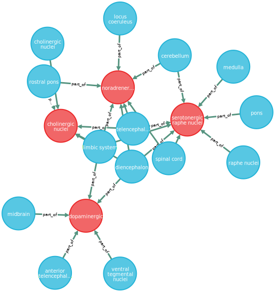

# Brain Structure Database
This is a project for my advanced databases class. Information on brain networks, written in json files, is inserted into the database and a graph of connections between structures and networks is built. The idea is to look at which networks share common structures and if modification of said structures activity affects functionality of both networks. 

## Polyglot Persistence
This database uses both MongoDB and Neo4J to store data with MongoDB being the authoritative database. MongoDB stores more information on the brain networks such as name, structures, function, and citations. Neo4J only uses the name and structures to build a graph. 

## How to start?
#### Install Prerequisites 
I did all of my implementation on a linux machine. To install MongoDB, I used [this](https://tecadmin.net/install-mongodb-on-ubuntu/) site and to install Neo4J, I used [this](https://datawookie.netlify.com/blog/2016/09/installing-neo4j-on-ubuntu-16.04/) site. Once installed start MongoDB by running _sudo systemctl start mongod_ and start Neo4J by running _sudo service neo4j start_.

#### Using the Program
1. Enter the brain structure information into a json file following the structure laid out in networks-structure.json. I put all my networks in networks.json.
2. Run init\_dbs() (in the driver.py file) to clear out any existing data and create an index forcing brain networks to be unique.
3. Run json\_load\_dbs(‘networks.json’) with your json file name to insert data for the first time into both MongoDB and Neo4J. Both databases will simply pass over duplicate network information.
4. Run rebuild\_neo4j() to rebuild the graph in Neo4J from MongoDB.

## Example Network
Here is an example using the neuromodulatory systems, because they had higher connectivity than most networks did. More examples can be seen in example-networks. &nbsp;  

## Example Queries
These queries are run using the individual database interfaces. The MongoDB database can be accessed through the shell using the _mongo_ command and Neo4J can be accessed using [http://localhost:7474/browser/](http://localhost:7474/browser/).

##### Neo4J
* Get structure and networks it is part of
        $ match (s:Structure {name: 'anterior insula'}) -[r] - (n) return s, n, r;
* Get all the general structures given part of their name
        match (s:Structure) where s.name contains 'insula' return s;
* Get general structures and networks they're part of
        match (s:Structure) where s.name contains 'insula' match (s) - [r] - (n:Network) return s, r, n;
* Get network and its associated structures
        match (n:Network {name: 'present moment pathway'}) - [r] - (s:Structure) return n, s, r;
* Get all things connected (long distance) to a structure
      match (s1:Structure {name: 'insula'}), (s2:Structure) where s1.name <> s2.name match p = allShortestPaths((s1) - [r*] - (s2)) return p;
* Return networks that share a common structure with given network
        match (n1:Network {name: 'hate circuit'}), (n2:Network) where n1.name <> n2.name match p = allShortestPaths((n1)-[r*]-(n2)) return p;

##### MongoDB
* List network name and function
        db.circuits.find({}, {_id:0, name: 1, function: 1})
* Find citations for all networks
        db.circuits.find({}, {_id:0, name: 1, citations: 1})
* Find all networks containing structure X
        db.circuits.find({structures: /^insula/}, {_id: 0, name: 1})
* Find all networks containing structure X, regardless of anterior, posterior etc.
        db.circuits.find({structures: /insula/}, {_id: 0, name: 1, structures: 1})
* Find all information for single network
        db.circuits.find({name: /present moment pathway/})

## Disclaimer
This is a very rough idea/draft for a course project. Most of the networks were entered by me skimming papers looking for structures to enter. For simplicity, I ignored if activity was increased or decreased as well as which hemisphere(s) activity was occurring in if they were given. There is no guarantee of accuracy. 
